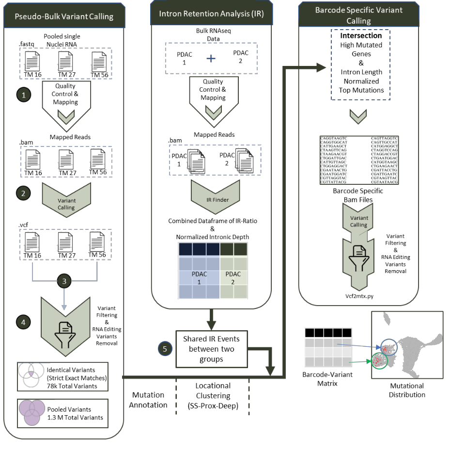

# VarSpliceDetect
Novel pipeline for full-length snRNA generated by [ICELL8&reg; cx Single-Cell](https://www.takarabio.com/products/automation-systems/icell8-system-and-software/icell8-cx-single-cell-system) to identify intronic variants causing mis-splicing events.



## Requirements
### Genome assembly references
- [ENSEMBL _Homo Sapiens_ hg38 FASTA file](http://ftp.ensembl.org/pub/release-107/fasta/homo_sapiens/dna/Homo_sapiens.GRCh38.dna.primary_assembly.fa.gz)
- [ENSEMBL _Homo Sapiens_ GTF annotation v107](http://ftp.ensembl.org/pub/release-103/gtf/homo_sapiens/Homo_sapiens.GRCh38.107.gtf.gz)
- [DBsnp Variant Set](https://ftp.ncbi.nih.gov/snp/organisms/human_9606/VCF/)
- [REDI-Portal RNA Editing Sites](http://srv00.recas.ba.infn.it/webshare/ATLAS/donwload/TABLE1_hg38.txt.gz)
### Software
- [Cogent NGS Analysis Pipeline v1.5](https://www.takarabio.com/products/automation-systems/icell8-system-and-software/bioinformatics-tools/cogent-ngs-analysis-pipeline)
- [cutadapt v2.5](https://cutadapt.readthedocs.io/en/stable/)
- [STAR v2.7.10a](https://github.com/alexdobin/STAR)
- [samtools v1.15.1](https://www.htslib.org/)
- [featureCounts v1.6.4](https://cutadapt.readthedocs.io/en/stable/)
- [GATK v4.1.9.0](https://gatk.broadinstitute.org/hc/en-us)
- [Ensembl VEP-Variant Effect Predictor](https://github.com/Ensembl/ensembl-vep)
- [Genome Tools GT](http://genometools.org/tools/gt.html)
- [Pl!nk](https://zzz.bwh.harvard.edu/plink/)
- [VCF2MAF](https://github.com/mskcc/vcf2maf)

# Prerequisiteries
- VCF conversion of REDI coordinates by plink is required
- Chromosome notations based on the reference data should be considered in every step of the analysis

# Usage
## 1. Single-cell RNA-seq datasets
ICELL8 originated dataset have been analyzed as proposed in previous [method](https://github.com/UKHG-NIG/single-cell-cellenion-icell8#1-single-cell-rna-seq-datasets)

## 2. Variant Calling with Pseudo-Bulk snRNA data
BAM files are combined in sample-wise manner to be able to call sample-specific variants.
Generated data have been processed with gold standard [GATK Variant Calling Pipeline for RNA-seq](https://gatk.broadinstitute.org/hc/en-us/articles/360035531192-RNAseq-short-variant-discovery-SNPs-Indels-)

```Shell
GATK AddOrReplaceReadGroups -I sample.bam -O sample.group.bam -SO coordinate --CREATE_INDEX true --RGID RNA --RGLB RNA --RGPL Illumina --RGPU Hiseq --RGSM $sample --TMP_DIR /tmp
```
```Shell
GATK MarkDuplicates -I sample.group.bam -O sample.marked.bam --METRICS_FILE sample.metrics --CREATE_INDEX true --VALIDATION_STRINGENCY LENIENT
```
```Shell
GATK SplitNCigarReads -R genome.fa -I sample.marked.bam -O sample.split.bam --tmp-dir /tmp
```
```Shell
GATK BaseRecalibrator -R genome.fa -I sample.marked.bam -known-sites known_snp.vcf.gz -O sample_recalibration_table.grp
```
```Shell
GATK ApplyBQSR -R genome.fa -I sample.marked.bam -bqsr sample_recalibration_table.grp 
```
```Shell
GATK HaplotypeCaller -R genome.fa -I sample.split.bam -O sample.vcf
```
```Shell
GATK VariantFiltration -R genome.fa -V sample.vcf -O sample_filt.vcf --window 35 --cluster 3 --filter-name FS --filter "FS > 30.0" --filter-name QD --filter "QD < 2.0"
```

## 3. REDI (RNA Editing) Variant Filtering
Since data is originated from nuclear RNAseq, it is required to remove editing variants as follows:

```Shell
vcftools --vcf sample_flit.vcf --out sample_filt_REDI.vcf --bed noChr_REDI_final.bed --recode --keep-INFO-all
```
## 4. Selection of Shared Variants
Variant Selection Process has been took place by bcftools-isec 
bcftools isec -p shared_variants -Oz a.vcf.gz b.vcf.gz c.vcf.gz

Identified Shared variants are merged by bcftools-merge
```Shell
bcftools merge --merge- all 0001.vcf.gz 0002.vcf.gz 0003.vcf.gz
```
## 5. MAF Conversion from Shared VCF File
To annotate intronic mutations, VCF files were converted to MAF (Mutation Annotation File) by using Variant Effect Predictor Tool (VEP) and produces annotated, shared variants among all patients. Also, locational distribution of all variants represented as barplot have been generated by deep_ss_prox_barplot.py ```├──scripts``` to generate ```├──figure 3.a``` 

## 6. Locational Distribution of Intronic Mutations
Locational sub-grouping of the mutations have been generated by locational_grouping.py ```├──scripts```. It takes gtf file to annotate exon-intron junction coordinates and use variant coordinates to count total number of splice-site (SS), proximal (prox) and deep intronic mutations counts of all genes and exports generates tsv files for all sub-regions.

## 7. Normalization of Number of Intronic mutation Counts Based on Gene
Normalization of the intronic mutation numbers based on total intronic length and number of introns have been made by normalize_by_gene.R ```├──scripts```. 
